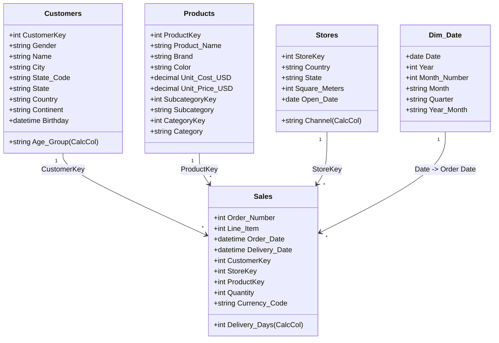

# Semantic Model & Star Schema Architecture

Detailed documentation of the Tabular Semantic Model implemented in `orignal made by me.SemanticModel/definition/`.

---

## 1. Schema Topology: Star Schema

The model follows Kimball dimensional modeling principles, centering on one high-volume fact table (`Sales`) surrounded by four conforming dimension tables.



---

## 2. Relationships Specification

All relationships in the active data model use **1:Many (One-to-Many)** cardinality with **Single (unidirectional)** cross-filtering, ensuring deterministic filter propagation and preventing circular ambiguity.

| From Table (Many) | From Column | To Table (One) | To Column | Cardinality | Filter Direction |
| :--- | :--- | :--- | :--- | :--- | :--- |
| `Sales` | `CustomerKey` | `Customers` | `CustomerKey` | Many to One (`*:1`) | Single |
| `Sales` | `ProductKey` | `Products` | `ProductKey` | Many to One (`*:1`) | Single |
| `Sales` | `StoreKey` | `Stores` | `StoreKey` | Many to One (`*:1`) | Single |
| `Sales` | `Order Date` | `Dim_Date` | `Date` | Many to One (`*:1`) | Single |

---

## 3. Dimension Tables

### A. `Customers` (15,266 Rows)
- **Primary Key**: `CustomerKey`
- **Demographics**: `Gender` (Male, Female), `Birthday`, `Age Group` (DAX calculated column).
- **Geography**: `City`, `State Code`, `State`, `Zip Code`, `Country`, `Continent`.

### B. `Products` (2,517 Rows)
- **Primary Key**: `ProductKey`
- **Catalog Hierarchy**: `Category` (e.g., Computers, Cameras and camcorders, Audio, TV and Video) $\to$ `Subcategory` $\to$ `Product Name`.
- **Financial Attributes**: `Unit Cost USD`, `Unit Price USD`.
- **Branding**: `Brand` (e.g., Contoso, Litware, Fabrikam, Adventure Works), `Color`.

### C. `Stores` (67 Rows)
- **Primary Key**: `StoreKey`
- **Physical Footprint**: 66 physical retail stores across 8 countries, with exact floor space footprint (`Square Meters`).
- **Online Channel**: Virtual store `StoreKey = 0` representing all ecommerce activity.
- **Classification**: `Channel` column (`Online` vs `Physical Store`).

### D. `Dim_Date` (DAX Calendar Dimension)
- Generated dynamically using DAX:
  ```dax
  ADDCOLUMNS(
      CALENDAR(DATE(2016, 1, 1), DATE(2021, 2, 27)),
      "Year", YEAR([Date]),
      "Month Number", MONTH([Date]),
      "Month", FORMAT([Date], "MMMM"),
      "Quarter", "Q" & FORMAT([Date], "Q"),
      "Year Month", FORMAT([Date], "YYYY-MM")
  )
  ```
- Ensures contiguous, gapless date intelligence for time series analysis and trend visual slicing.
