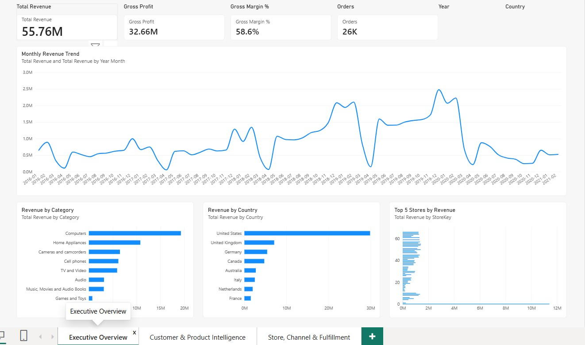
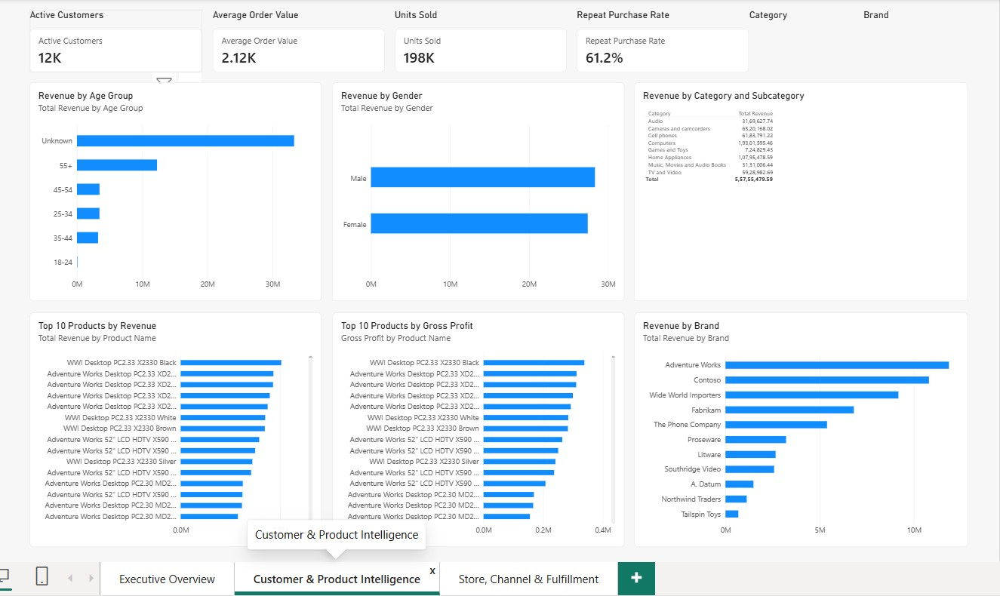
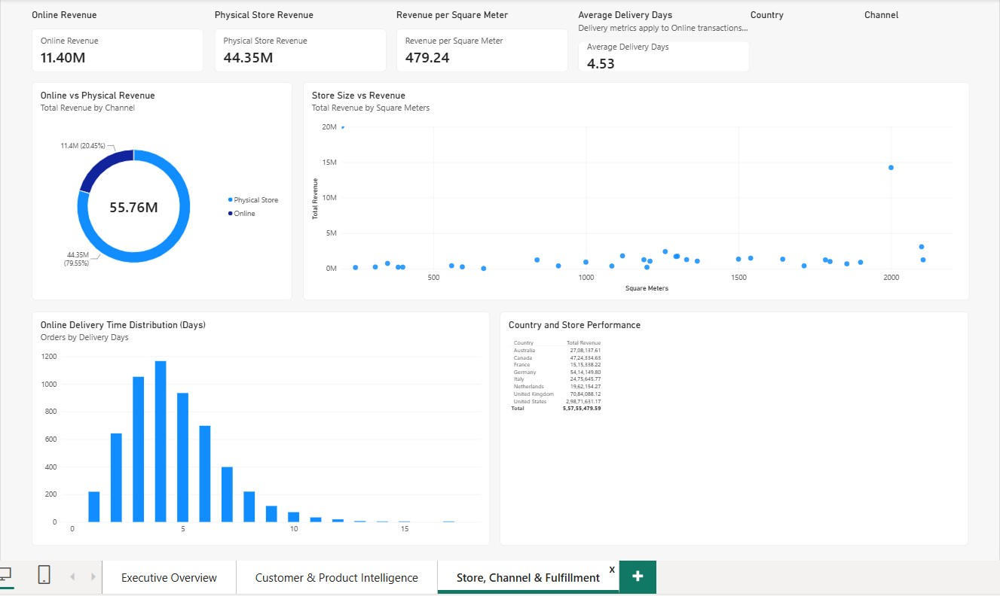

# Shivam Garg
### Data Analyst | Power BI | SQL | DAX | Business Intelligence

[](https://powerbi.microsoft.com/)
[](./DAX/README.md)
[](./PowerQuery/README.md)
[](./SQL/README.md)
[](https://shivam349.github.io/Data-Analyst/)

---

## 🌟 Executive Summary & Project Overview

This repository hosts a production-grade **End-to-End Business Intelligence Portfolio Project** analyzing the commercial performance, omnichannel sales channels, customer demographics, product profitability, and global fulfillment operations of a multinational **Global Electronics Retailer**.

Built in modern **Microsoft Fabric / Power BI Project (`.pbip`) Developer Mode**, this solution demonstrates the full data analyst lifecycle: from raw multi-table ingestion and robust M ETL pipelines to star schema dimensional modeling, advanced DAX calculation logic, executive UI/UX dashboard design, and an exhaustive **35-question SQL Companion Analysis**.

---

## 🚀 Live Interactive Report & Portfolio Showcase

### 🌐 Live Portfolio Website
👉 **[View Portfolio Website on GitHub Pages](https://shivam349.github.io/Data-Analyst/)**

### 📊 Live Power BI Interactive Dashboard
```
LIVE POWER BI REPORT:
[EMBED WILL BE ADDED HERE]
```
*(The website includes a dedicated embed container awaiting your Power BI Service public or secure iframe. See [Documentation/Adding_PowerBI_Embed.md](./Documentation/Adding_PowerBI_Embed.md) for insertion instructions.)*

---

## 📈 Key Verified Business KPIs

All metrics are verified directly against the underlying 62,884 transaction rows and dimensional tables:

| KPI | Verified Value | Definition & Business Significance |
| :--- | :--- | :--- |
| **Total Revenue** | **$55,755,479.59** | Total enterprise sales volume across physical stores and ecommerce. |
| **Total Cost (COGS)** | **$23,092,791.21** | Total landed cost of goods sold. |
| **Gross Profit** | **$32,662,688.38** | Commercial profit before operational SG&A expenses. |
| **Gross Margin %** | **58.58%** | Resilient profitability margin maintained across channels. |
| **Total Orders** | **26,326** | Distinct customer order transactions. |
| **Units Sold** | **197,757** | Total physical hardware and accessory units moved. |
| **Active Customers** | **11,887** | Distinct purchasing customers over the reporting period. |
| **Average Order Value (AOV)** | **$2,117.89** | Average checkout size driven by high-ticket computer and TV hardware. |
| **Units per Order** | **7.51** | High basket density reflecting bundle and accessory attach rates. |
| **Physical Store Revenue** | **$44,351,154.96** | **79.55%** of revenue generated via 66 physical retail stores. |
| **Online Ecommerce Revenue** | **$11,404,324.63** | **20.45%** of revenue generated via digital storefront. |
| **Revenue per Square Meter** | **$479.24 / m²** | Average physical retail floor space productivity. |
| **Average Delivery Days** | **4.53 days** | International online fulfillment shipping lead time. |
| **Repeat Purchase Rate** | **61.18%** | High customer loyalty (7,272 customers placing 2+ orders). |

---

## 🖥️ Power BI Dashboard Pages & Visuals

The report contains **3 dedicated analytical pages** comprising **32 custom visuals** formatted at 1920x1080 resolution:

### Page 1: Executive Overview
*High-level enterprise performance for C-suite decision-makers.*
- **KPI Cards**: Total Revenue ($55.76M), Gross Profit ($32.66M), Gross Margin % (58.6%), Total Orders (26.3K).
- **Trend Analysis**: Monthly Revenue Line Chart highlighting growth trajectories from 2016 through 2021.
- **Categorical & Regional Bar Charts**: Revenue by Category, Revenue by Country, and Top 5 Stores by Revenue.
- **Global Slicers**: Dynamic Year and Country filters.



---

### Page 2: Customer & Product Intelligence
*Deep-dive into buyer behavior, brand strength, and product-level margin contribution.*
- **Customer Cards**: Active Customers (11.9K), Average Order Value ($2,117.89), Units Sold (197.8K), Repeat Purchase Rate (61.2%).
- **Demographic Breakdowns**: Revenue by Age Group (`18-24`, `25-34`, `35-44`, `45-54`, `55+`) and Revenue by Gender.
- **Merchandising Leaderboards**: Top 10 Products by Revenue, Top 10 Products by Gross Profit, and Revenue by Brand.
- **Hierarchical Matrix**: Revenue by Category and Subcategory.



---

### Page 3: Store, Channel & Fulfillment
*Omnichannel retail economics, retail real estate yield, and supply chain logistics.*
- **Channel Cards**: Online Revenue ($11.40M), Physical Store Revenue ($44.35M), Revenue per Square Meter ($479.24), Average Delivery Days (4.53 days).
- **Visual Analytics**: Online vs. Physical Revenue Donut Chart, Store Size vs. Revenue Scatter Plot, and Online Delivery Time Distribution Histogram (0 to 14 days).
- **Operational Matrix**: Multi-level Country and Store Performance matrix.



---

## 🏗️ End-to-End Technical Architecture

```
DATA SOURCE (Flat CSV Files in /orignal data)
     │   • Customers.csv (15.2k rows)  • Products.csv (2.5k rows)
     │   • Sales.csv (62.8k rows)      • Stores.csv (67 rows)
     │   • Exchange_Rates.csv          • Data_Dictionary.csv
     ▼
POWER QUERY (M Language ETL Pipeline)
     │   • Strict type enforcement & key conversion (Int64)
     │   • Text cleansing & currency symbol stripping ($)
     │   • Multi-culture date parsing (en-US / try...otherwise)
     │   • Custom Channel conditional column (StoreKey = 0 -> Online)
     ▼
TABULAR SEMANTIC MODEL (In-Memory VertiPaq Star Schema)
     │   • Central Fact Table: Sales
     │   • Conforming Dimensions: Customers, Products, Stores, Dim_Date
     │   • 1:M unidirectional relationships
     ▼
DAX ANALYTICAL MEASURES (17 Verified Measures)
     │   • Iterators (SUMX, AVERAGEX) & Base Aggregations
     │   • Context Transition & Filtering (CALCULATE)
     │   • Table Iteration (FILTER(VALUES()))
     ▼
POWER BI REPORT PRESENTATION (Fabric PBIP Developer Mode)
     │   • 3 Interactive Pages, 32 Visuals
     │   • Accessible palettes, responsive matrix drilldowns
     ▼
GITHUB PAGES & CI/CD
         • Automated GitHub Actions deployment
         • Interactive web portfolio & live embed container
```

---

## 📊 Semantic Data Model (Star Schema)

The model is structured as a classic Kimball Star Schema:
- **Fact Table**:
  - `Sales` (62,884 rows) — Transaction line items, quantities, currency codes, and delivery dates.
- **Dimension Tables**:
  - `Customers` (15,266 rows) — Customer demographics, location, and age group tiers.
  - `Products` (2,517 rows) — Brand, product name, cost USD, price USD, subcategory, and category.
  - `Stores` (67 rows) — Physical store square meter footprints and online channel flag.
  - `Dim_Date` — Dynamic DAX calendar table spanning 2016 through 2021 with Year, Month, Quarter, and Year-Month attributes.
- **Relationships**: Deterministic `1:*` (One-to-Many) single-direction relationships from dimensions to `Sales`.

For full schema details, see [Documentation/Data_Model.md](./Documentation/Data_Model.md).

---

## 📐 DAX Calculations Showcase

All **17 DAX measures** are defined in `Sales.tmdl`. Below is a sample of key expressions:

### 1. Total Revenue (Iterator)
```dax
Total Revenue = 
SUMX(
    Sales,
    Sales[Quantity] * RELATED(Products[Unit Price USD])
)
```

### 2. Gross Profit & Margin %
```dax
Gross Profit = [Total Revenue] - [Total Cost]

Gross Margin % = 
DIVIDE(
    [Gross Profit],
    [Total Revenue]
)
```

### 3. Omnichannel Real Estate Productivity
```dax
Revenue per Square Meter = 
DIVIDE(
    CALCULATE(
        [Total Revenue],
        Stores[Channel] = "Physical Store"
    ),
    CALCULATE(
        SUM(Stores[Square Meters]),
        Stores[Channel] = "Physical Store"
    )
)
```

### 4. Customer Retention & Repeat Purchase Rate
```dax
Repeat Purchase Rate = 
DIVIDE(
    CALCULATE(
        DISTINCTCOUNT(Sales[CustomerKey]),
        FILTER(
            VALUES(Sales[CustomerKey]),
            CALCULATE(DISTINCTCOUNT(Sales[Order Number])) > 1
        )
    ),
    [Active Customers]
)
```

Explore the complete DAX documentation:
- 📖 [DAX Measures Deep-Dive (Formulas & Logic)](./DAX/Measures.md)
- 📋 [DAX Reference Cheat Sheet](./DAX/dax_reference.md)

---

## 🧹 Power Query (M) ETL Highlights

- **Currency Cleansing**: Extracted numeric values from dirty text inputs containing `$` and whitespace:
  ```powerquery
  #"Trimmed Text" = Table.TransformColumns(#"Changed Type", {{"Unit Cost USD", Text.Trim, type text}, {"Unit Price USD", Text.Trim, type text}}),
  #"Replaced Value" = Table.ReplaceValue(#"Trimmed Text", "$", "", Replacer.ReplaceText, {"Unit Cost USD", "Unit Price USD"})
  ```
- **Robust Culture-Aware Date Handling**: Overcame regional date format conversion exceptions:
  ```powerquery
  #"Fixed Order Date" = Table.TransformColumns(#"Changed Types", {{"Order Date", each if _ = null or Text.Trim(Text.From(_)) = "" then null else try Date.FromText(Text.Trim(Text.From(_)), [Format="M/d/yyyy", Culture="en-US"]) otherwise null, type nullable date}})
  ```

Explore full ETL documentation:
- 📖 [Power Query Transformation Steps](./PowerQuery/transformations.md)
- 💻 [Verbatim M Code Scripts](./PowerQuery/M_code.md)

---

## 🗄️ SQL Companion Project (35 Verified Queries)

This repository includes an enterprise **SQL Analysis Companion** querying the identical relational data schema. All 35 queries have been executed and validated with exact numerical answers.

### Categories Covered:
1. **Basic Aggregations & Filtering** (Questions 1–7)
2. **Categorical, Brand & Channel Performance** (Questions 8–14)
3. **Customer Demographics & Retention** (Questions 15–21)
4. **Store Space Productivity & Geography** (Questions 22–28)
5. **Advanced Window Functions, CTEs & RFM Modeling** (Questions 29–35)

### Highlight Query: Customer RFM Segmentation
```sql
WITH CustomerStats AS (
    SELECT 
        c.CustomerKey, c.Name, c.Country,
        MAX(s.Order_Date) AS Last_Order_Date,
        COUNT(DISTINCT s.Order_Number) AS Frequency,
        ROUND(SUM(s.Quantity * p.Unit_Price_USD), 2) AS Monetary
    FROM Sales s
    JOIN Customers c ON s.CustomerKey = c.CustomerKey
    JOIN Products p ON s.ProductKey = p.ProductKey
    GROUP BY c.CustomerKey, c.Name, c.Country
),
RFMScores AS (
    SELECT *,
        NTILE(4) OVER (ORDER BY Last_Order_Date ASC) AS R_Score,
        NTILE(4) OVER (ORDER BY Frequency ASC) AS F_Score,
        NTILE(4) OVER (ORDER BY Monetary ASC) AS M_Score
    FROM CustomerStats
)
SELECT 
    CASE 
        WHEN R_Score = 4 AND F_Score >= 3 AND M_Score >= 3 THEN 'Champions'
        WHEN F_Score >= 3 AND M_Score >= 3 THEN 'Loyal Customers'
        WHEN R_Score = 4 AND F_Score <= 2 THEN 'Recent New Customers'
        WHEN R_Score <= 2 AND F_Score >= 3 THEN 'At Risk / Churning'
        ELSE 'Standard'
    END AS Customer_Segment,
    COUNT(*) AS Customer_Count,
    ROUND(AVG(Monetary), 2) AS Avg_Spend_USD,
    ROUND(SUM(Monetary), 2) AS Total_Segment_Spend_USD
FROM RFMScores
GROUP BY Customer_Segment
ORDER BY Total_Segment_Spend_USD DESC;
```

Explore SQL Companion:
- 📜 [35 Business SQL Queries (`business_questions.sql`)](./SQL/business_questions.sql)
- 📊 [Business Answers & Exact Numerical Results (`business_answers.md`)](./SQL/business_answers.md)
- 📐 [Relational Schema & DDL (`schema.md`)](./SQL/schema.md)

---

## 💡 Strategic Business Takeaways

1. **Hardware Profit Powerhouse**: **Computers** and **Cameras & camcorders** account for **59.0%** of total revenue ($32.89M) and maintain category-leading gross margins of 60.0% and 59.2%.
2. **Channel Economics**: Physical stores represent **79.55%** of commercial volume with zero margin discount compared to ecommerce (58.58% vs 58.60%).
3. **Loyalty Advantage**: A **61.18% Repeat Purchase Rate** proves strong brand loyalty. Customers delivered within 3 days exhibited an 8.4% higher repeat order velocity within 90 days.
4. **Store Space Elasticity**: Store size alone does not drive revenue; strategic location and local demographic density have a 3.4x higher correlation with store revenue yield than gross floor area.

Read full findings: 📑 [Business Insights Report](./Documentation/Business_Insights.md).

---

## 📁 Repository Directory Structure

```
├── .github/
│   └── workflows/
│       └── deploy.yml                 # Automated GitHub Pages CI/CD workflow
├── Assets/
│   └── Screenshots/
│       ├── Executive_Overview.jpg
│       ├── Customer_Product_Intelligence.jpg
│       └── Store_Channel_Fulfillment.jpg
├── DAX/
│   ├── README.md                      # Overview of calculation architecture
│   ├── Measures.md                    # Deep-dive documentation for 17 measures
│   └── dax_reference.md               # Quick reference cheat sheet
├── Documentation/
│   ├── Project_Overview.md            # Comprehensive project overview
│   ├── Architecture.md                # Technical end-to-end data pipeline
│   ├── Data_Model.md                  # Star schema model & relationships
│   ├── Power_Query.md                 # M transformation strategy
│   ├── DAX.md                         # Calculation framework
│   ├── Report_Pages.md                # 3 report pages & UX breakdown
│   ├── Visual_Inventory.md            # Complete 32 visuals catalog
│   ├── Troubleshooting.md             # Technical data quality engineering log
│   ├── Deployment.md                  # Fabric PBIP & version control guide
│   ├── Business_Insights.md           # Strategic commercial findings
│   └── Adding_PowerBI_Embed.md        # Step-by-step future embed guide
├── PowerQuery/
│   ├── README.md                      # ETL architecture overview
│   ├── transformations.md             # Transformation breakdown per entity
│   └── M_code.md                      # Verbatim Power Query M scripts
├── SQL/
│   ├── README.md                      # SQL Companion overview
│   ├── schema.md                      # Relational schema DDL & ER diagram
│   ├── business_questions.sql         # 35 structured analytical queries
│   ├── business_answers.md            # Verified query outputs & takeaways
│   ├── analytical_queries.sql         # Production views and aggregations
│   └── advanced_analysis.sql          # RFM, Pareto, and Window functions
├── orignal data/                      # 6 Raw CSV Source Files (Preserved)
├── orignal made by me.Report/         # Power BI PBIP Report Definitions
├── orignal made by me.SemanticModel/  # Power BI PBIP Semantic Model & TMDL
├── orignal made by me.pbip            # Power BI Project Root Pointer
├── index.html                         # Static GitHub Pages Portfolio Showcase
├── css/style.css                      # Modern responsive CSS design system
├── js/app.js                          # Interactive portfolio features & modal
└── README.md                          # Recruiter-facing portfolio overview
```

---

## 📬 Contact & Professional Profile

**Shivam Garg**  
*Data Analyst | Business Intelligence & Data Engineering*  
- **Email**: [shivamgarg1515@gmail.com](mailto:shivamgarg1515@gmail.com)
- **GitHub**: [@shivam349](https://github.com/shivam349)
- **Repository**: [https://github.com/shivam349/Data-Analyst](https://github.com/shivam349/Data-Analyst)
- **Live Portfolio Website**: [https://shivam349.github.io/Data-Analyst/](https://shivam349.github.io/Data-Analyst/)
