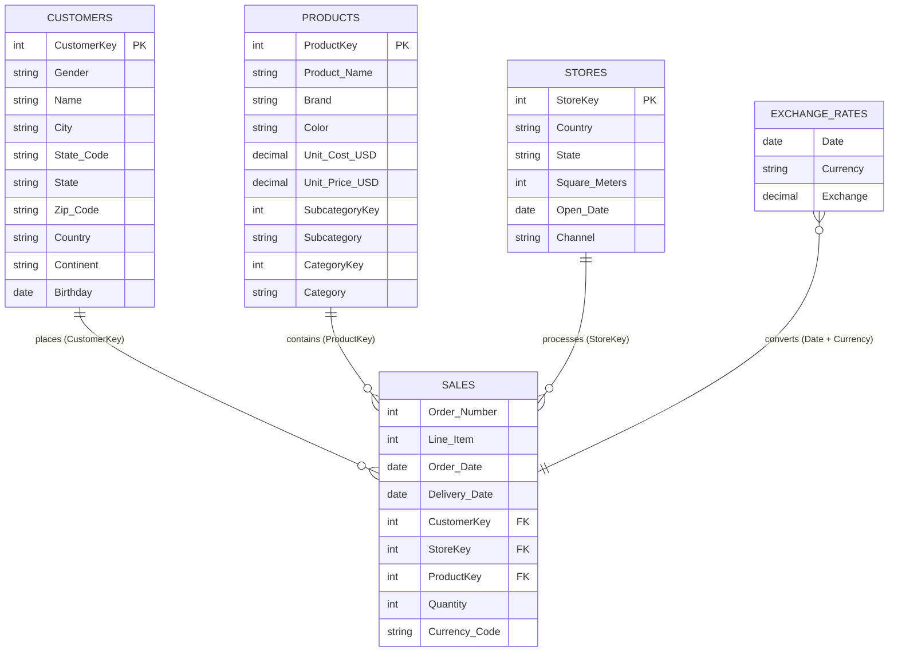

# Relational Data Model & SQL Schema Specification

This document details the relational data model for the **Global Electronics Retailer** dataset used in the SQL Companion analysis.

> [!NOTE]
> While the original Power BI report directly imported flat CSV files via Power Query, this schema represents the production-grade normalized relational schema (Star Schema) designed for enterprise data warehouse (EDW) and SQL analytical workflows.

---

## 1. Entity Relationship Overview (Star Schema)



---

## 2. Table Specifications & DDL

### A. Fact Table: `Sales`
Stores transaction-level order line items.
- **Grain**: One record per line item per customer order.
- **Row Count**: 62,884 rows.

```sql
CREATE TABLE Sales (
    Order_Number   INTEGER NOT NULL,
    Line_Item      INTEGER NOT NULL,
    Order_Date     DATE NOT NULL,
    Delivery_Date  DATE,
    CustomerKey    INTEGER NOT NULL,
    StoreKey       INTEGER NOT NULL,
    ProductKey     INTEGER NOT NULL,
    Quantity       INTEGER NOT NULL CHECK (Quantity > 0),
    Currency_Code  VARCHAR(3) NOT NULL,
    PRIMARY KEY (Order_Number, Line_Item),
    FOREIGN KEY (CustomerKey) REFERENCES Customers(CustomerKey),
    FOREIGN KEY (StoreKey) REFERENCES Stores(StoreKey),
    FOREIGN KEY (ProductKey) REFERENCES Products(ProductKey)
);

CREATE INDEX idx_sales_order_date ON Sales(Order_Date);
CREATE INDEX idx_sales_customer ON Sales(CustomerKey);
CREATE INDEX idx_sales_product ON Sales(ProductKey);
CREATE INDEX idx_sales_store ON Sales(StoreKey);
```

### B. Dimension Table: `Customers`
Stores demographic and regional customer profiles.
- **Grain**: One record per registered customer.
- **Row Count**: 15,266 rows.

```sql
CREATE TABLE Customers (
    CustomerKey  INTEGER PRIMARY KEY,
    Gender       VARCHAR(10),
    Name         VARCHAR(100) NOT NULL,
    City         VARCHAR(100),
    State_Code   VARCHAR(20),
    State        VARCHAR(100),
    Zip_Code     VARCHAR(20),
    Country      VARCHAR(100) NOT NULL,
    Continent    VARCHAR(50) NOT NULL,
    Birthday     DATE
);

CREATE INDEX idx_customers_country ON Customers(Country);
```

### C. Dimension Table: `Products`
Stores product hierarchy, brand, unit cost, and price in USD.
- **Grain**: One record per SKU.
- **Row Count**: 2,517 rows.

```sql
CREATE TABLE Products (
    ProductKey      INTEGER PRIMARY KEY,
    Product_Name    VARCHAR(200) NOT NULL,
    Brand           VARCHAR(100) NOT NULL,
    Color           VARCHAR(50),
    Unit_Cost_USD   DECIMAL(10, 2) NOT NULL,
    Unit_Price_USD  DECIMAL(10, 2) NOT NULL,
    SubcategoryKey  INTEGER NOT NULL,
    Subcategory     VARCHAR(100) NOT NULL,
    CategoryKey     INTEGER NOT NULL,
    Category        VARCHAR(100) NOT NULL
);

CREATE INDEX idx_products_category ON Products(Category);
CREATE INDEX idx_products_brand ON Products(Brand);
```

### D. Dimension Table: `Stores`
Stores physical and online sales channels.
- **Grain**: One record per physical retail outlet plus StoreKey 0 representing Online.
- **Row Count**: 67 rows (66 physical locations, 1 online store).

```sql
CREATE TABLE Stores (
    StoreKey       INTEGER PRIMARY KEY,
    Country        VARCHAR(100) NOT NULL,
    State          VARCHAR(100),
    Square_Meters  INTEGER,
    Open_Date      DATE,
    Channel        VARCHAR(20) NOT NULL DEFAULT 'Physical Store'
);
```

### E. Reference Table: `Exchange_Rates`
Historical foreign exchange conversion rates relative to USD.
- **Grain**: Daily exchange rate per currency.
- **Row Count**: 11,215 rows.

```sql
CREATE TABLE Exchange_Rates (
    Date      DATE NOT NULL,
    Currency  VARCHAR(3) NOT NULL,
    Exchange  DECIMAL(10, 4) NOT NULL,
    PRIMARY KEY (Date, Currency)
);
```
